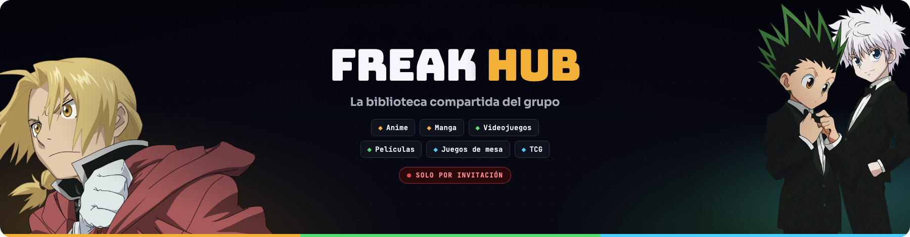
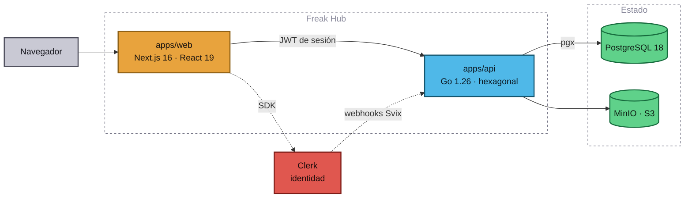
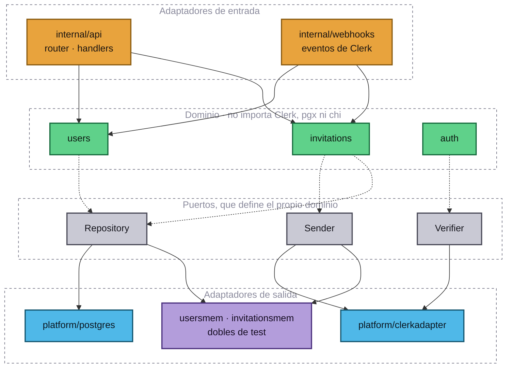
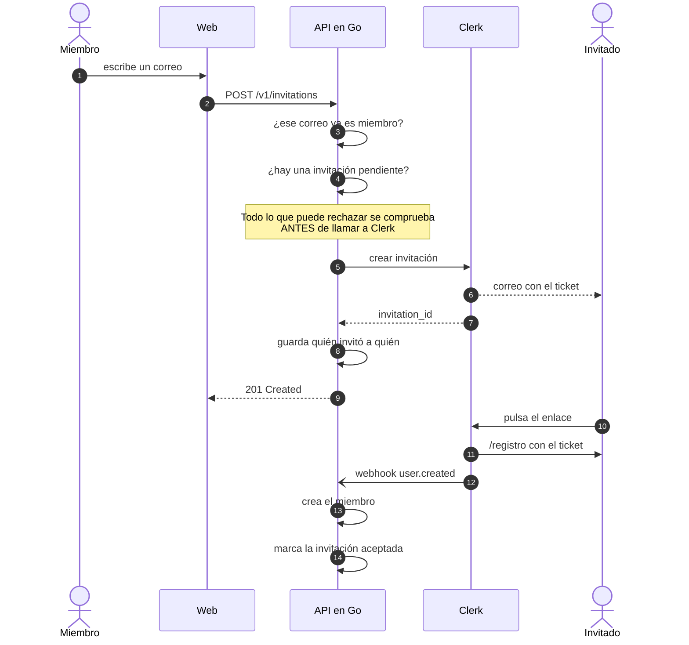

<div align="center">



<br/>
<br/>

Registra lo que ves, lees y juegas. Apunta lo que tienes pendiente.<br/>
Descubre qué recomiendan los tuyos. **Solo entra quien recibe una invitación.**

<br/>


[](https://github.com/alvaroofernaandez/freak-hub/actions/workflows/ci.yml)


<br/>

```sh
pnpm install && pnpm infra:up && pnpm dev
```

<br/>

**[⚡ Arranque](#-arranque)** ·
**[🧬 Arquitectura](#-arquitectura)** ·
**[🔐 Acceso](#-acceso)** ·
**[🗺️ Mapa](#️-mapa-del-repositorio)** ·
**[🎴 Catálogos](#-catálogos)** ·
**[🧪 Tests](#-tests)** ·
**[📚 Docs](#-documentación)**

</div>

---

## 🎯 En una pantalla

Un grupo de amigos, seis categorías y una sola pregunta que resolver: **¿qué estás
viendo, leyendo o jugando ahora mismo?**

Freak Hub es una red social diminuta y cerrada. No hay algoritmo, ni descubrimiento
público, ni desconocidos: solo la gente que ya se conoce llevando la cuenta de sus
cosas en el mismo sitio.

<table>
<tr>
<td width="50%" valign="top">

**Lo que registras**

| | |
| :-- | :--- |
| 📺 | Anime, con su progreso por episodio |
| 📖 | Manga, por capítulos o tomos |
| 🎮 | Videojuegos, de cualquier plataforma |
| 🎬 | Películas |
| 🎲 | Juegos de mesa y sus expansiones |
| 🃏 | Cartas y mazos de TCG |

</td>
<td width="50%" valign="top">

**Lo que haces con ello**

| | |
| :-- | :--- |
| 🔖 | Wishlist: un estado más, no otra lista |
| ⭐ | Favorito y nota son cosas distintas |
| 🎁 | Recomiendas a alguien concreto, con motivo |
| 👀 | Ves la actividad del grupo, sin algoritmo |
| ✉️ | Invitas a un colega, sin pedir permiso |
| 📦 | Exportas lo tuyo cuando quieras |

</td>
</tr>
</table>

<details>
<summary><b>¿Y qué NO es Freak Hub?</b></summary>

<br/>

**No es un catálogo público.** No compite con AniList, Letterboxd ni Backloggd:
esos ya existen y son mejores en eso.

**No tiene recomendaciones automáticas.** Las recomendaciones las hacen personas,
a personas concretas, explicando por qué. Una recomendación que reciben todos no
la lee nadie.

**No tiene métricas de vanidad.** Ni seguidores, ni rachas, ni insignias. Nada que
convierta ver una serie en una competición.

**No escala a un público abierto.** Es una decisión de producto, no una limitación
técnica. Si algún día hiciera falta, sería otro producto.

Más en [docs/product.md](docs/product.md).

</details>

---

## 🧬 Arquitectura



**La regla que lo explica casi todo: Next.js nunca habla con Postgres.** Todo el
dominio pasa por la API en Go. Cuesta un salto de red y a cambio una regla de
negocio vive en un solo sitio: el día que haya app móvil o bot de Discord, no hay
nada que reimplementar.

<details>
<summary><b>Por qué hexagonal, y cómo se nota</b></summary>

<br/>



Fíjate en la dirección de las flechas de puntos: **el dominio no apunta a nadie
de fuera**. Define sus puertos y son los adaptadores los que encajan en ellos.

La prueba no es teórica. Toda la lógica del backend se testea **sin Postgres, sin
red y sin un JWT real**, en menos de un segundo, cambiando los adaptadores por los
dobles en memoria. El día que no puedas testear una regla sin levantar Docker, esa
regla está en el sitio equivocado.

Detalle completo en [docs/architecture.md](docs/architecture.md) y las decisiones,
con sus alternativas descartadas, en [docs/decisions/](docs/decisions/).

</details>

---

## 🔐 Acceso

**Solo se entra con invitación.** La instancia de Clerk corre en modo `restricted`:
sin un ticket, el registro sencillamente no existe.



| | |
| :--- | :--- |
| **Quién invita** | Cualquier miembro, sin cupo |
| **Se registra** | Quién invitó a quién, siempre |
| **Métodos** | Email + contraseña · Google · Discord |
| **Contraseñas** | Mínimo 12, zxcvbn ≥ 3, contrastadas con HIBP |
| **Protección** | CAPTCHA, bloqueo a los 10 intentos, sin correos desechables |

Cuatro reglas que tiene el código, no el panel:

1. **Nada se envía antes de validar.** Correo inválido, ya miembro o invitación
   pendiente se rechazan antes de llamar a Clerk. Un rechazo nunca deja un correo
   en la bandeja de nadie.
2. **La fila local se escribe después de que Clerk confirme.** Si Clerk falla, no
   queda registro fantasma.
3. **Un índice único parcial** es la última línea contra dos personas invitando a
   la vez al mismo correo.
4. **La API nunca dice por qué rechaza.** Token caducado y firma corrupta responden
   lo mismo. El detalle va al log.

Todo el flujo en [docs/auth.md](docs/auth.md).

---

## ⚡ Arranque

Node ≥ 22 · pnpm 10 · Go 1.26 · Docker · [Clerk CLI](https://clerk.com/docs/cli)

```sh
# 1. Entorno
cp .env.example .env                    # pon contraseñas de verdad
cp apps/web/.env.example apps/web/.env.local
clerk env pull --file apps/web/.env.local

# 2. Dependencias e infraestructura
pnpm install
pnpm infra:up                           # Postgres + MinIO + bucket
make -C apps/api migrate-up

# 3. Las dos aplicaciones, en dos terminales
pnpm dev                                # web → localhost:3000
pnpm api:dev                            # api → localhost:8080

# 4. Comprobación
curl -s localhost:8080/healthz          # {"status":"ok"}
```

<details>
<summary><b>El huevo y la gallina: ¿cómo entra el primero?</b></summary>

<br/>

El registro está cerrado, así que **nadie puede entrar todavía**. Ni siquiera tú.
Es exactamente lo que queríamos, pero hay que romper el círculo una vez.

Deja el reenvío de webhooks corriendo:

```sh
clerk webhooks --forward-to http://localhost:8080/webhooks/clerk
```

Y invítate a ti mismo desde el CLI:

```sh
clerk api POST /invitations \
  --json '{"email_address":"tu@correo.com","redirect_url":"http://localhost:3000/registro"}'
```

Te llega el correo, completas el registro, el webhook crea tu fila en `members` y
a partir de ahí ya puedes invitar desde `/invitar` como todo el mundo.

Si te registras **sin** el reenvío activo, la sesión será válida pero `/v1/me`
responderá `404 unknown_identity`. Se arregla reenviando el evento desde el panel
de Clerk.

</details>

---

## 🗺️ Mapa del repositorio

```
freak-hub/
├── apps/
│   ├── web/              Next.js 16 · React 19 · Tailwind 4 · Clerk
│   │   └── src/
│   │       ├── app/          enrutado. Sin lógica de negocio
│   │       ├── features/     el dominio, una carpeta por funcionalidad
│   │       ├── shared/       api-client · routes · tipos del contrato
│   │       └── proxy.ts      middleware de Clerk (Next 16 lo llama así)
│   │
│   └── api/              Go 1.26 · chi · pgx · sqlc · goose
│       ├── cmd/              composition root y migraciones
│       ├── internal/
│       │   ├── users/            entidad · puerto · servicio · doble
│       │   ├── invitations/      idem
│       │   ├── auth/             Identity y middleware de sesión
│       │   ├── webhooks/         eventos de Clerk → dominio
│       │   ├── api/              router y handlers
│       │   └── platform/         clerk · svix · postgres · httpx
│       └── db/               migrations/ y queries/
│
├── packages/contracts/   openapi.yaml + tipos TypeScript generados
├── tools/assets/         genera el banner y la imagen social del repo
├── docs/                 toda la documentación del proyecto
└── docker-compose.yml    Postgres · MinIO · (perfil apps) web y api
```

---

## 🎴 Catálogos

Las fichas vienen de catálogos públicos **y** se pueden crear a mano. Ninguna de
las dos cosas sola funciona: un mazo casero no está en ninguna API, y dar de alta
todo a mano mata el proyecto en una semana.

| Categoría | Proveedor | Clave |
| :--- | :--- | :--- |
| 🌸 Anime · Manga | AniList (GraphQL) | no hace falta |
| 🎬 Películas | TMDB | sí |
| 🎮 Videojuegos | IGDB | OAuth de Twitch |
| 🎲 Juegos de mesa | BoardGameGeek (XML) | no hace falta |
| 🃏 TCG | Scryfall | no hace falta |

Las claves viven **en la API**, nunca en el navegador. Límites y particularidades
de cada proveedor en [docs/catalogs.md](docs/catalogs.md).

---

## 🧪 Tests

**TDD estricto.** Rojo → verde → refactor, sin atajos. Escribir el código y
"cubrirlo con tests" después no es TDD: es test de regresión de código en el que
ya confías, y te has saltado justo la parte que aporta diseño.

```sh
pnpm test                  # Vitest + Testing Library
pnpm test:e2e              # Playwright
make -C apps/api test      # go test -race
pnpm diagrams:check        # los diagramas de estos docs parsean de verdad
```

Lo que ya está blindado:

- ✅ Una ruta protegida **nunca** se vuelve pública por accidente
- ✅ El middleware rechaza sin cabecera, con esquema erróneo, con token vacío y con
  token inválido, y **no filtra el motivo** al cliente
- ✅ Un webhook sin firma válida **no llega al dominio**
- ✅ Un webhook repetido no crea dos miembros
- ✅ Una invitación rechazada **nunca** llega a Clerk
- ✅ Si Clerk falla al enviar, **no queda fila local**

Más en [docs/testing.md](docs/testing.md).

---

## 📚 Documentación

<table>
<tr>
<td valign="top" width="50%">

| Documento | Responde a… |
| :--- | :--- |
| [product.md](docs/product.md) | Qué es y qué **no** es |
| [domain.md](docs/domain.md) | Obras, entradas, estados |
| [architecture.md](docs/architecture.md) | Cómo encaja todo |
| [auth.md](docs/auth.md) | Clerk, sesiones, invitaciones |
| [api.md](docs/api.md) | El contrato HTTP |
| [data-model.md](docs/data-model.md) | Esquema y migraciones |

</td>
<td valign="top" width="50%">

| Documento | Responde a… |
| :--- | :--- |
| [catalogs.md](docs/catalogs.md) | Las APIs externas |
| [development.md](docs/development.md) | El día a día |
| [testing.md](docs/testing.md) | Estrategia y flujo TDD |
| [deployment.md](docs/deployment.md) | El VPS, paso a paso |
| [roadmap.md](docs/roadmap.md) | Qué está hecho y qué viene |
| [decisions/](docs/decisions/) | Los ADR |

</td>
</tr>
</table>

Para agentes de IA: [AGENTS.md](AGENTS.md).

---

## 🚧 Estado

Los **cimientos están terminados**: monorepo, autenticación funcionando de punta a
punta, invitaciones, contrato, tests, CI y despliegue.

El **dominio está por construir**. Lo siguiente, en orden, es cerrar la dirección
visual y levantar `works` + `library_entries` con una sola categoría antes de
generalizar a las seis.

> [!NOTE]
> **La dirección visual ya está decidida** (["character select"](docs/design.md),
> [ADR-0008](docs/decisions/0008-direccion-visual.md)): extiende la identidad de
> este mismo banner —oscuro, paleta oklch, un color por categoría— a toda la
> aplicación. `globals.css` todavía lleva los tokens provisionales; sustituirlos
> es el siguiente paso, antes de construir pantallas de verdad. El banner y la
> imagen social de este README se regeneran con `pnpm assets:render`.

Detalle completo en [docs/roadmap.md](docs/roadmap.md).

<div align="center">
<br/>
<sub>Arte de <a href="https://fullmetalalchemist.fandom.com/">Fullmetal Alchemist</a> y <a href="https://hunterxhunter.fandom.com/">Hunter × Hunter</a>, propiedad de sus autores. Uso no comercial en un proyecto privado entre amigos.</sub>
</div>
