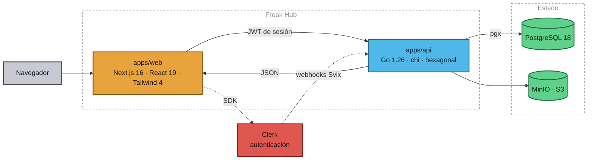

# Arquitectura

## Vista general



## La regla que lo explica casi todo

**Next.js nunca habla con Postgres.** Toda la lectura y escritura de dominio pasa
por la API en Go. La web es una capa de presentación con sesión.

Esto cuesta un salto de red, y a cambio da:

- **Un solo sitio donde vive una regla de negocio.** Cuando mañana haya una app
  móvil o un bot de Discord, no hay que reimplementar nada.
- **Una superficie de seguridad pequeña.** Las credenciales de base de datos
  existen en un único proceso.
- **Un contrato explícito** ([api.md](api.md)) en lugar de acoplamiento difuso.

La excepción son los webhooks de Clerk, que van **directos a Go** en vez de pasar
por Next: el backend verifica la firma Svix y escribe en su base de datos, sin
saltos intermedios que solo añadirían un punto de fallo.

## El monorepo

```
freak-hub/
├── apps/
│   ├── web/                 Next.js 16 · React 19 · Tailwind 4 · Clerk
│   └── api/                 Go 1.26 · chi · pgx · sqlc · goose
├── packages/
│   └── contracts/           openapi.yaml + tipos TypeScript generados
├── docs/                    esta documentación
├── .agents/                 contexto para agentes de IA
└── docker-compose.yml       Postgres, MinIO y (con perfil) las dos apps
```

Un solo repositorio porque el contrato entre la web y la API cambia a la vez. Un
cambio de endpoint es **un commit**, no dos PR coordinadas en dos repos.

## Dentro de `apps/api` — arquitectura hexagonal

```
apps/api/
├── cmd/
│   ├── api/                 composition root: lee config, cablea, sirve
│   └── migrate/             aplica las migraciones embebidas
├── internal/
│   ├── config/              carga y valida el entorno
│   ├── auth/                Identity + middleware de sesión (puerto Verifier)
│   ├── users/               dominio de miembros
│   │   ├── user.go              entidad y errores
│   │   ├── repository.go        PUERTO de persistencia
│   │   ├── service.go           casos de uso
│   │   └── usersmem/            doble en memoria para tests
│   ├── invitations/         dominio de invitaciones (misma forma)
│   ├── webhooks/            traduce eventos de Clerk a llamadas de dominio
│   ├── api/                 ADAPTADOR de entrada: router y handlers HTTP
│   └── platform/            ADAPTADORES de salida
│       ├── clerkadapter/        verificación de JWT y envío de invitaciones
│       ├── svix/                verificación de firma de webhooks
│       ├── postgres/            repositorios sobre sqlc
│       └── httpx/               helpers de JSON y sobre de errores
└── db/
    ├── migrations/          goose, embebidas en el binario
    └── queries/             SQL fuente para sqlc
```

### Qué gana esto realmente

La dirección de las dependencias apunta **siempre hacia el dominio**:
`internal/users` no importa Clerk, ni pgx, ni chi. Sabe de `Repository`, que es
una interfaz que él mismo define.

La prueba no es teórica. Toda la lógica de sesión (`internal/auth`), de miembros
(`internal/users`), de invitaciones (`internal/invitations`) y de webhooks se
testea **sin Postgres, sin red y sin un JWT real**, en milisegundos, con dobles
en memoria. Eso solo es posible porque el dominio no conoce a sus adaptadores.

### Reglas para no romperlo

1. Un paquete de dominio **no importa** nada de `internal/platform` ni ninguna
   librería de infraestructura.
2. Los puertos los define **quien los usa** (el dominio), no quien los implementa.
3. Los handlers HTTP no tienen lógica de negocio: parsean, llaman y traducen
   errores de dominio a códigos de estado.
4. `cmd/api/main.go` es el **único** sitio donde se instancian adaptadores
   concretos.

## Dentro de `apps/web` — por funcionalidad

```
apps/web/src/
├── app/                     App Router: SOLO enrutado y composición
│   ├── (app)/                   rutas con sesión (layout con navegación)
│   ├── entrar/ · registro/      pantallas de Clerk
│   ├── layout.tsx · globals.css
│   └── page.tsx                 portada pública
├── features/                el dominio, una carpeta por funcionalidad
│   └── invitations/
│       ├── actions/             server actions
│       └── ui/                  componentes de esa funcionalidad
├── shared/
│   ├── api/                     tipos derivados del contrato OpenAPI
│   ├── lib/                     api-client, routes, cn
│   └── ui/                      componentes reutilizables
└── proxy.ts                 middleware de Clerk (Next 16 lo llama "proxy")
```

`app/` es enrutado, no es donde vive la lógica. Una funcionalidad nueva crea su
carpeta en `features/` y la ruta solo la compone.

## Decisiones que conviene conocer antes de tocar nada

- **`proxy.ts`, no `middleware.ts`.** Next.js 16 renombró la convención.
- **Clerk Core 3** eliminó `<SignedIn>` y `<SignedOut>`: ahora es
  `<Show when="signed-in">`. Y `<ClerkProvider>` va **dentro** de `<body>`.
- **Todo está protegido por defecto.** `shared/lib/routes.ts` es el único sitio
  que abre una ruta, y está cubierto por tests.
- **sqlc, no un ORM.** El SQL se escribe a mano en `db/queries` y sqlc genera Go
  tipado. Sin magia, sin sorpresas de rendimiento.
- **Biome, no ESLint + Prettier.** Un binario, una configuración, en la raíz.
