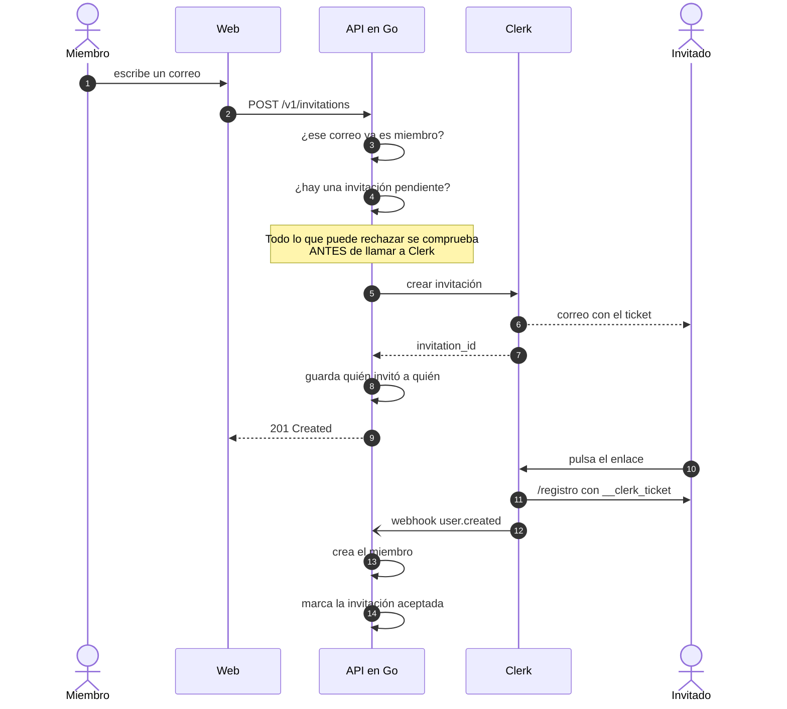

# Autenticación e invitaciones

## El modelo en una frase

Clerk es la fuente de verdad de las cuentas; Postgres guarda una proyección
local del miembro; **solo se entra con invitación**, y cualquier miembro puede
invitar.

## La aplicación de Clerk

| Dato | Valor |
| :--- | :--- |
| Aplicación | `Freak Hub` |
| `application_id` | `app_3Ifq7MwJ0XnLHATROvcFJtILGlK` |
| Instancia de desarrollo | `ins_3Ifq7RVBzUVpDP1BnJ3RxXFOzOA` |
| Cuenta propietaria | `cdo@hagalink.es` |

Está vinculada a este directorio (`clerk link`), así que el CLI resuelve la
aplicación sin argumentos.

## Configuración aplicada

Se aplicó con `clerk config patch`. Es reproducible: el fichero de configuración
es lo que manda, no los clics en el panel.

| Ajuste | Valor | Por qué |
| :--- | :--- | :--- |
| `sign_up_mode` | `restricted` | **La regla central**: sin invitación no hay registro |
| `block_disposable_email_domains` | `true` | Correos de usar y tirar fuera |
| Email | obligatorio y verificado al registrarse | Es la clave con la que se casa la invitación |
| Contraseña | mínimo 12, zxcvbn ≥ 3, comprobada contra HIBP | Un grupo pequeño no necesita contraseñas débiles |
| Nombre de usuario | obligatorio, 3–24 caracteres | Es una red social: hace falta un handle |
| Google | activado | |
| Discord | activado | Donde ya vive el grupo |
| Protección de bots | CAPTCHA `smart` | |
| Bloqueo de cuenta | 10 intentos, 60 minutos | |
| `paths.sign_in` | `/entrar` | |
| `paths.sign_up` | `/registro` | |

> En desarrollo, Google y Discord usan las credenciales compartidas de Clerk. **En
> producción hay que registrar aplicaciones OAuth propias** y meter `client_id` y
> `client_secret`; si no, el login social fallará al pasar a producción.

### Reproducir o cambiar la configuración

```sh
clerk config pull --output clerk-config.json   # ver el estado actual
clerk config patch --file config.json --dry-run
clerk config patch --file config.json
```

## Cómo viaja una sesión

1. La persona entra en `/entrar`; los componentes de Clerk gestionan el flujo.
2. Clerk deja una sesión en el navegador.
3. La web pide un JWT con `getToken()` y lo manda como
   `Authorization: Bearer <token>`.
4. La API verifica la firma contra el **JWKS** de Clerk
   (`internal/platform/clerkadapter/verifier.go`). El SDK cachea el juego de
   claves, así que verificar es una comprobación local, no una llamada de red por
   petición.
5. El middleware convierte el token en una `auth.Identity` y la mete en el
   contexto. Los handlers ya no ven tokens.

### El perímetro

- En la web: **todo está protegido salvo lo que aparezca en
  `shared/lib/routes.ts`**. Añadir una página no la expone por accidente.
- En la API: todo lo que cuelga de `/v1` pasa por `auth.Middleware`. `/healthz` es
  público a propósito y `/webhooks/clerk` se autentica con firma, no con sesión.
- La API **nunca** devuelve el motivo real del rechazo. Un token caducado y una
  firma corrupta responden lo mismo: `401 invalid_token`. El detalle va al log.

## El flujo de invitación



### Las reglas y dónde están escritas

Todas viven en `internal/invitations/service.go`, y todas tienen test:

1. **Cualquier miembro invita, sin cupo.** Fue una decisión explícita: el grupo
   crece por confianza, no por permisos.
2. **Se registra quién invitó a quién** (`invitations.inviter_id`). Sin límite,
   pero con trazabilidad: si alguien mete a quien no debe, se sabe.
3. **Nada se envía antes de validar.** Email inválido, ya miembro o invitación
   pendiente se rechazan **antes** de llamar a Clerk. Un rechazo nunca deja un
   correo en la bandeja de nadie.
4. **La fila local se escribe después de que Clerk confirme.** Si Clerk falla, no
   queda un registro fantasma.
5. **Un índice único parcial** (`invitations_pending_email_idx`) es la última
   línea de defensa contra dos miembros invitando a la vez a la misma persona.

## Webhooks

Clerk entrega los eventos en `POST /webhooks/clerk`, firmados con Svix.

| Evento | Efecto |
| :--- | :--- |
| `user.created` | Crea el miembro y marca su invitación como aceptada |
| `user.updated` | Refresca nombre, usuario y avatar |
| `user.deleted` | Borra el miembro |
| cualquier otro | Se responde 204 y se ignora |

Tres decisiones que importan:

- **Se verifica la firma antes de parsear.** Una entrega sin firmar no es tráfico
  nuestro y no llega al dominio.
- **Todo es idempotente.** Las entregas son *at-least-once* y pueden llegar
  desordenadas: `EnsureFromClerk` hace upsert por `clerk_user_id`.
- **El código de estado es semántico.** 422 cuando el evento no se puede procesar
  nunca (reintentar no ayudaría) y 500 cuando el fallo es nuestro (queremos que
  Clerk reintente).

### Configurar el webhook

1. En el panel de Clerk: **Webhooks → Add Endpoint**.
2. URL: `https://<tu-api>/webhooks/clerk`.
3. Eventos: `user.created`, `user.updated`, `user.deleted`.
4. Copia el *Signing Secret* a `CLERK_WEBHOOK_SIGNING_SECRET`.

En local, para recibirlos sin exponer el puerto:

```sh
clerk webhooks --forward-to http://localhost:8080/webhooks/clerk
```

## El hueco entre el registro y el primer webhook

Hay una ventana de milisegundos en la que la sesión es válida pero el miembro
todavía no existe en Postgres. La API lo dice explícitamente
(`404 unknown_identity`) en lugar de fingir un problema de autenticación. La web
debe tratarlo como "espera un momento", no como "no tienes permiso".
