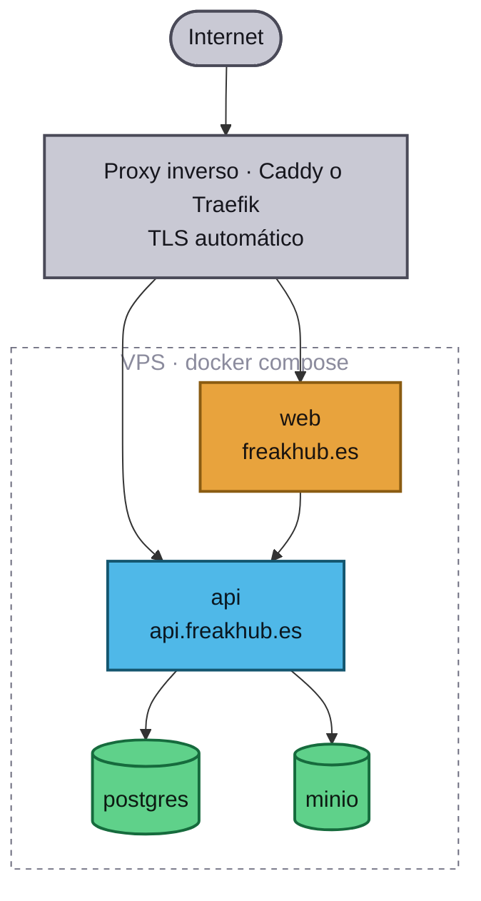

# Despliegue

## Dónde vive

Un **VPS propio** con Docker Compose: Postgres, MinIO, la API en Go y la web de
Next.js. Coste fijo bajo y control total, a cambio de encargarnos nosotros de
copias de seguridad, TLS y actualizaciones.



El proxy inverso **no está en el compose todavía**: es lo primero que hay que
añadir al montar el servidor real. Sin él, la web y la API quedarían expuestas
por puerto y sin TLS.

## Puesta en marcha en el servidor

```sh
git clone git@github.com:alvaroofernaandez/freak-hub.git
cd freak-hub

cp .env.example .env
# Rellena, como mínimo:
#   POSTGRES_PASSWORD, MINIO_ROOT_PASSWORD      → contraseñas largas y aleatorias
#   API_ENV=production
#   API_ALLOWED_ORIGINS=https://freakhub.es     → obligatorio en producción
#   CLERK_SECRET_KEY, CLERK_WEBHOOK_SIGNING_SECRET
#   NEXT_PUBLIC_CLERK_PUBLISHABLE_KEY, NEXT_PUBLIC_API_URL, NEXT_PUBLIC_APP_URL

docker compose --profile apps build
docker compose --profile apps run --rm migrate
docker compose --profile apps up -d
```

`API_ALLOWED_ORIGINS` es obligatorio con `API_ENV=production`: la configuración
se niega a arrancar con el valor por defecto de localhost, para que no se cuele
un despliegue que acepte cualquier origen sin querer.

## Antes de abrirlo al mundo

- [ ] Proxy inverso con TLS delante de web y API.
- [ ] Aplicaciones OAuth **propias** de Google y Discord en Clerk. En desarrollo
      Clerk presta las suyas; en producción no.
- [ ] Instancia de **producción** de Clerk (`clerk deploy`), con su dominio y sus
      claves `pk_live` / `sk_live`.
- [ ] Webhook apuntando a `https://api.freakhub.es/webhooks/clerk`.
- [ ] Copias de seguridad de Postgres programadas **y una restauración probada**.
      Una copia que nunca se ha restaurado no es una copia.
- [ ] Postgres y MinIO **sin puertos publicados** al exterior; solo la red interna
      del compose.
- [ ] Rotar todas las contraseñas del `.env.example`.

## Actualizar

```sh
git pull
docker compose --profile apps build
docker compose --profile apps run --rm migrate
docker compose --profile apps up -d
```

Las migraciones se aplican **antes** de arrancar la versión nueva, así que deben
ser compatibles hacia atrás durante el instante en que conviven las dos.

## Despliegue desde GitHub Actions

El workflow de despliegue es **manual** (`workflow_dispatch`), a propósito: un
grupo de amigos no necesita despliegue continuo, y un merge accidental no debería
tumbar el servicio. Cuando quieras automatizarlo, el sitio es
`.github/workflows/deploy.yml`.

## Copias de seguridad

```sh
# Volcado
docker compose exec -T postgres pg_dump -U freakhub freakhub | gzip > backup-$(date +%F).sql.gz

# Restauración
gunzip -c backup-2026-08-31.sql.gz | docker compose exec -T postgres psql -U freakhub freakhub
```

MinIO se copia sincronizando su volumen con `mc mirror` a otro destino.

## Observabilidad

Hoy: logs estructurados en JSON (`slog`) a stdout, que recoge Docker.

Cuando duela, en este orden: métricas de Postgres (conexiones y consultas
lentas), tiempos de respuesta de la API y alerta sobre `/healthz`. No antes: la
observabilidad prematura es infraestructura que mantener sin nadie que la mire.
