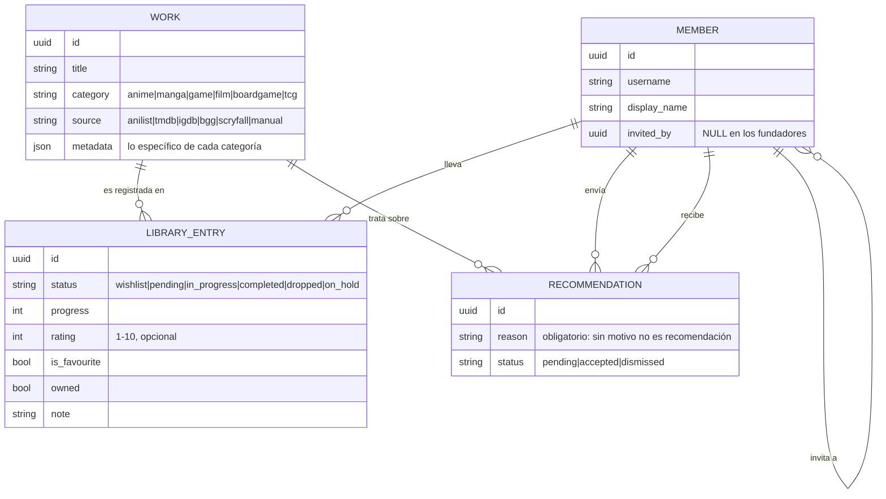
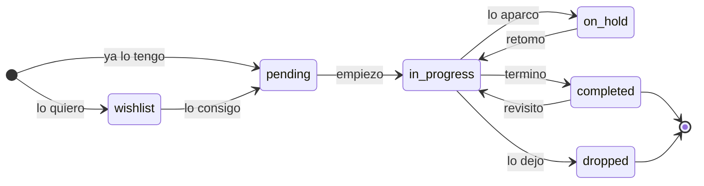

# Modelo de dominio

Este documento describe el modelo **conceptual**. El esquema físico está en
[data-model.md](data-model.md), y hoy solo existen las tablas de `members` e
`invitations`: el resto es el contrato que iremos implementando.

## El problema de fondo

Un anime, un mazo de Magic y un juego de mesa no se parecen en nada. Un anime
tiene episodios, un manga capítulos, un juego horas, una película una duración
única y un mazo ni siquiera tiene progreso. Modelar esto mal lleva a uno de dos
desastres:

- **Una tabla por categoría**, con seis veces la misma lógica de estados,
  valoraciones y favoritos duplicada.
- **Una tabla genérica con treinta columnas nulas**, donde nada significa nada.

La salida es separar **qué es una cosa** de **qué relación tienes tú con ella**.

## Las tres piezas

Una obra es **compartida por todo el grupo**; la relación con ella es **de cada
persona**. Esa separación es lo que hace que las coincidencias y las
recomendaciones signifiquen algo.

### Work — la obra

La ficha objetiva de algo: título, categoría, año, portada, sinopsis. Es
**compartida por todo el grupo**: si tú y yo vemos el mismo anime, apuntamos al
mismo `Work`. Así las recomendaciones y las coincidencias funcionan.

Un `Work` puede venir de un catálogo externo (con su `source` y su `source_id`,
ver [catalogs.md](catalogs.md)) o haberse creado a mano cuando no aparece en
ninguna API.

Lo específico de cada categoría (número de episodios, plataforma, número de
jugadores, set de cartas) vive en un campo `metadata` JSONB, **no** en columnas
nuevas. La regla: si un dato solo aplica a una categoría, va en `metadata`; si
aplica a todas, es columna.

### LibraryEntry — tu relación con la obra

Lo que convierte un catálogo en *tu* biblioteca. Une un `Member` con un `Work` y
guarda:

| Campo | Qué significa |
| :--- | :--- |
| `status` | `wishlist`, `pending`, `in_progress`, `completed`, `dropped`, `on_hold` |
| `progress` | Unidad según la categoría: episodios, capítulos, horas, partidas |
| `rating` | 1–10, opcional, solo tiene sentido cuando hay opinión formada |
| `is_favourite` | Afecto, no nota. Se puede tener un favorito con un 6 |
| `note` | Texto corto y privado por defecto |
| `owned` | Si lo tienes físicamente. Relevante en mesa, manga y TCG |
| `started_at` / `finished_at` | Fechas, opcionales |

El ciclo de vida de una entrada, que es donde se ve que la wishlist no necesita
tabla propia:

**La wishlist no es una lista aparte**: es `status = 'wishlist'`. Una entrada
pendiente pasa a en curso y luego a terminada sin cambiar de tabla ni perder su
historia.

### Member — la persona

Ver [auth.md](auth.md). Clerk manda en la autenticación; `members` es la
proyección local con la que se relacionan todas las demás tablas.

## Lo social

### Recommendation

Una recomendación es **de una persona a otra persona, sobre una obra, con un
motivo**. Nunca es automática y nunca es a todo el grupo a la vez: eso sería
spam. Estados: `pending`, `accepted` (quien la recibe la añade a su biblioteca)
y `dismissed`.

Que la recomendación sea dirigida es lo que hace que valga algo. Si todo el mundo
recibe todo, nadie lee nada.

### Feed de actividad

Cronológico, sin algoritmo, con los eventos del grupo: alguien terminó algo,
valoró algo, marcó un favorito, entró en el grupo. Se resuelve leyendo los
cambios de `LibraryEntry`, no con una tabla de eventos separada, hasta que el
volumen demuestre lo contrario.

## Reglas del dominio

1. Un miembro tiene **como máximo una** `LibraryEntry` por obra. Volver a ver algo
   se refleja en el progreso, no duplicando filas.
2. `rating` solo tiene sentido con `status` en `completed` o `dropped`. Puntuar
   algo que no has empezado no significa nada.
3. Un `Work` no se borra nunca aunque nadie lo tenga: es historia compartida.
4. Al borrar un miembro se borran sus entradas, sus recomendaciones y sus
   valoraciones. Sus `Work` se quedan.
5. La unidad de `progress` depende de la categoría, así que **la valida el
   dominio**, no la base de datos.

## Lo que aún no está decidido

- Si las notas pueden hacerse públicas al grupo (hoy son privadas).
- Si las expansiones de juegos de mesa son un `Work` propio o metadatos del
  juego base.
- Si un mazo de TCG es un `Work` (una carta concreta) o una entidad aparte que
  agrupa cartas. Probablemente lo segundo, y es la decisión de modelado más
  espinosa que queda pendiente.
